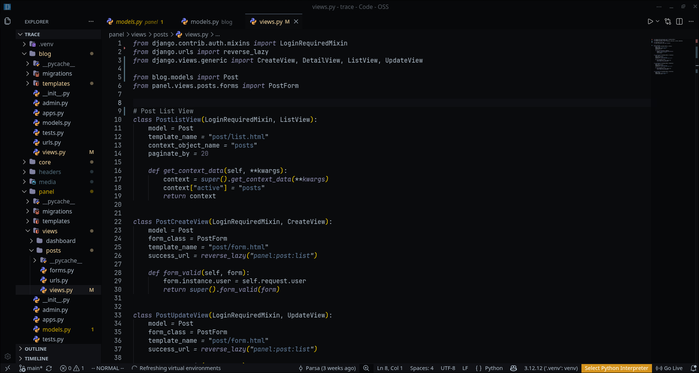
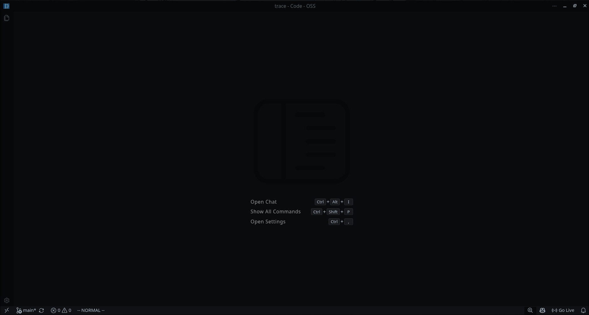

# Furusato for VS Code

> **"Furusato" (ふるさと)** — _a cozy place you return to._

A dark, modern VS Code theme with soft blues, greys, and subtle contrasts. Ported from the Neovim colorscheme [furusato.nvim](https://github.com/x017/furusato.nvim).

## Features

- Full VS Code dark theme
- Muted cool tones: blues, sea-blues, soft greys
- Warm yellows for highlights
- Minimal dark background
- Syntax highlighting for 30+ languages
- Editor UI theming (sidebar, status bar, tabs, terminal, etc.)

## Screenshots

  
  

## Installation

### From VSIX

1. Download the `.vsix` file from releases
2. Open VS Code
3. Press `Ctrl+Shift+P` and select "Extensions: Install from VSIX..."
4. Select the downloaded file

### From Source

1. Clone this repository
2. Run `npm install -g vsce`
3. Run `vsce package` in the theme directory
4. Install the generated `.vsix` file

## Usage

1. Open VS Code
2. Press `Ctrl+Shift+P` and select "Preferences: Color Theme"
3. Select "Furusato" from the list

## Palette

- **Background**: `#090b0d`
- **Foreground**: `#adbac7`
- **Comments**: `#8a949e`
- **Strings**: `#647f9e`
- **Keywords**: `#8f8fb3`
- **Functions**: `#8f8fb3`
- **Types**: `#7a8db0`
- **Numbers**: `#6f6f87`
- **Tags**: `#54657d`
- **Special**: `#7fa8c9`
- **Errors**: `#B86A6A`
- **Warnings**: `#f2d49e`
- **Info**: `#64778d`
- **Hints**: `#7fa8c9`

## License

MIT
